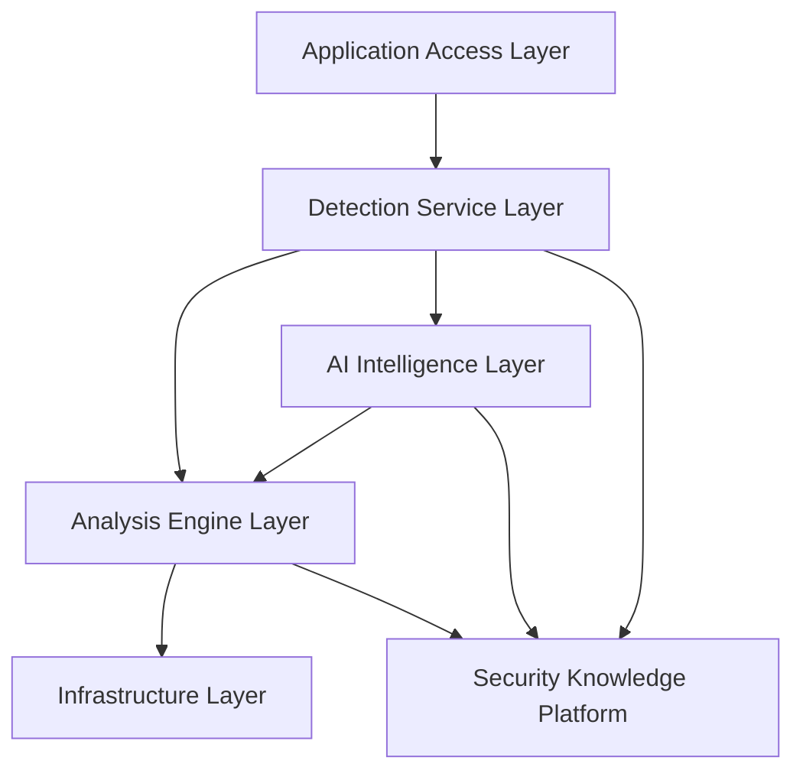
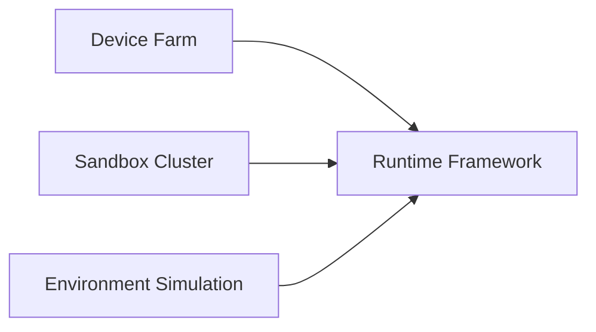

# 第4章 基础设施层（Infrastructure Layer）

> **Chapter 4**
>
> **Infrastructure Layer Overview**

---

# 1. 本章目标（Objectives）

基础设施层（Infrastructure Layer）是移动应用安全检测平台的运行底座，为分析引擎（Analysis Engine）提供稳定、真实、可重复的应用执行环境。

本章重点介绍基础设施层的整体设计思想、组成架构、核心能力及设计原则，为后续真机集群、沙箱集群、环境仿真及运行时框架等章节奠定基础。

阅读本章后，读者应理解：

- 为什么需要基础设施层；
- 基础设施层在整个六层架构中的定位；
- 基础设施层包含哪些核心组件；
- 基础设施层如何支撑静态分析、动态分析和 AI 检测；
- 基础设施层的关键设计原则及技术指标。

---

# 2. 为什么需要基础设施层（Motivation）

移动应用安全检测与传统 Web 安全扫描最大的区别在于，**大量安全风险只能在真实运行过程中暴露**。

例如：

- 恶意广告仅在用户点击后弹出；
- 涉诈页面需完成登录后才出现；
- 木马程序通过云控动态下发恶意模块；
- SDK 在运行时申请敏感权限；
- Native 层代码在运行过程中动态加载；
- 应用根据设备型号、地区、系统版本返回不同逻辑；
- 恶意应用检测模拟器环境后主动隐藏行为。

因此，一个仅依赖 APK 静态扫描的平台无法覆盖复杂的运行时风险。

为了真实还原终端环境，平台必须建设统一的基础设施层，为所有检测任务提供标准化运行环境。

基础设施层承担以下职责：

- 提供真实或高仿真的运行环境；
- 提供安全隔离能力，防止恶意程序逃逸；
- 提供统一的数据采集能力；
- 提供环境生命周期管理能力；
- 提供大规模任务执行能力。

基础设施层**不负责风险检测**，而是为分析引擎提供可信、稳定、可重复的执行环境。

---

# 3. 在总体架构中的定位

Infrastructure Layer 位于平台底层，是所有运行时分析能力的基础。

基础设施层仅向 **Analysis Engine Layer** 提供运行环境及运行数据，不直接向检测服务输出风险结果。

这种设计使检测逻辑与运行环境解耦，便于不同分析能力复用同一基础设施。

---

# 4. 基础设施层总体架构

基础设施层由四个核心模块组成。

各模块职责如下：

| 模块 | 职责 | 后续章节 |
|------|------|----------|
| Device Farm | 提供真实终端运行环境，支持硬件相关检测 | 第5章 |
| Sandbox Cluster | 提供大规模自动化动态检测环境 | 第6章 |
| Environment Simulation | 模拟真实用户设备、网络及地理环境 | 第7章 |
| Runtime Framework | 负责运行时监控、数据采集及环境管理 | 第8章 |

四个模块共同构成平台统一的运行基础设施。

---

# 5. 核心能力

## 5.1 真机运行能力（Real Device Execution）

针对以下场景，必须使用真实终端完成检测：

- Android Keystore；
- HarmonyOS 安全能力；
- 指纹、人脸等生物认证；
- TEE（Trusted Execution Environment）；
- Secure Element；
- 厂商定制 ROM 行为；
- 应用反模拟器检测。

真机环境提供最高可信度的检测结果。

---

## 5.2 沙箱运行能力（Sandbox Execution）

沙箱负责大规模自动化检测。

支持：

- 应用自动安装；
- 自动运行；
- 自动恢复；
- 快照管理；
- 批量调度；
- 网络隔离。

沙箱适用于大规模初筛。

---

## 5.3 环境仿真（Environment Simulation）

为了避免应用识别检测环境，需要模拟真实用户设备。

包括：

### 设备信息

- 品牌
- 型号
- Android API Level
- Harmony Version
- CPU ABI
- Screen Resolution
- DPI

### 用户环境

- 联系人
- 相册
- 通话记录
- 短信
- 已安装应用
- 剪贴板

### 网络环境

- Wi-Fi
- 4G / 5G
- VPN
- DNS
- 代理
- 网络延迟
- 丢包率

### 地理位置

- GPS
- 基站
- 时区
- 语言
- Locale

环境仿真的真实性直接影响动态检测的覆盖率。

---

## 5.4 Runtime Framework

Runtime Framework 是基础设施层最重要的公共组件。

负责：

- 生命周期管理；
- 环境初始化；
- 应用安装；
- 自动启动；
- 日志采集；
- Hook 数据采集；
- 网络抓包；
- 文件快照；
- 内存快照；
- Crash 收集；
- 环境恢复。

所有运行时数据最终统一输出给 Analysis Engine。

---

# 6. 数据输出模型（Output Model）

基础设施层不直接输出风险，而是输出标准化运行数据。

统一输出如下：

| 数据类型 | 描述 |
|----------|------|
| Runtime Log | 系统及应用运行日志 |
| Hook Event | Hook 捕获的 API 调用 |
| Network Traffic | 网络请求及响应 |
| File Activity | 文件读写行为 |
| Process Activity | 进程创建及退出 |
| Memory Snapshot | 内存快照 |
| Screen Capture | 页面截图 |
| Screen Recording | 运行录屏 |
| System Event | 系统广播及状态变化 |
| Device Metadata | 设备信息及环境参数 |

这些数据将作为 Analysis Engine 的输入。

---

# 7. 关键设计原则（Key Design Principles）

基础设施层遵循以下原则：

### 7.1 高真实性（High Fidelity）

运行环境应尽可能接近真实用户终端。

避免因环境差异导致恶意行为无法触发。

---

### 7.2 强隔离（Isolation）

每个检测任务均运行于独立环境。

任何恶意行为不得影响宿主系统及其他任务。

---

### 7.3 可重复（Repeatability）

同一应用在相同环境中应获得一致的运行结果。

支持环境快照及快速恢复。

---

### 7.4 自动化（Automation）

支持无人值守运行。

包括：

- 自动部署；
- 自动执行；
- 自动恢复；
- 自动回收。

---

### 7.5 可观测（Observability）

运行过程中产生的所有关键事件均可追踪。

保证检测过程可复现、可审计、可分析。

---

# 8. 技术指标（Metrics）

| 指标 | 建议值 |
|------|--------:|
| 真机覆盖品牌 | ≥15 个 |
| Android 系统版本覆盖 | Android 8–16 |
| HarmonyOS 版本覆盖 | 5.x–6.x |
| 沙箱并发能力 | ≥1000 实例 |
| 环境初始化时间 | ≤30 秒 |
| 环境恢复时间 | ≤60 秒 |
| 应用安装成功率 | ≥99% |
| 应用启动成功率 | ≥98% |
| Runtime 数据采集覆盖率 | ≥95% |
| 网络流量采集覆盖率 | 100% |
| Hook 事件采集覆盖率 | ≥95% |
| 快照恢复成功率 | ≥99% |

> 注：具体指标可根据企业规模、硬件资源及检测场景进行调整。

---

# 9. 本章总结（Summary）

基础设施层是 MASAP 的运行底座，其核心职责是提供真实、稳定、可重复的应用执行环境，并输出统一的运行时数据。

通过真机集群、沙箱集群、环境仿真及运行时框架，平台能够为分析引擎提供可信的数据来源，确保上层静态分析、动态分析及 AI 推理建立在一致的基础环境之上。

基础设施层本身不承担风险判断，而是作为整个安全检测平台的能力底座，为后续分析引擎和检测服务提供可靠支撑。

---

## 下一章

**第5章 真机集群（Device Farm）**

下一章将详细介绍真机集群的总体架构、设备管理、远程控制、运行时监控、资源调度及量化技术指标，并分析真机检测与沙箱检测的适用场景及协同策略。
