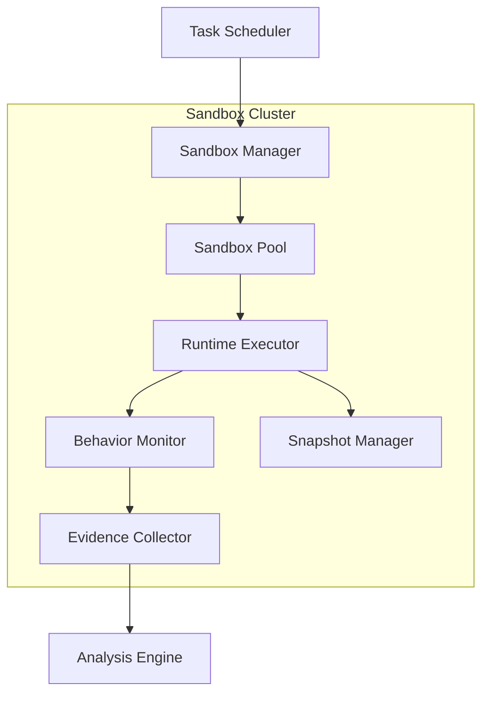
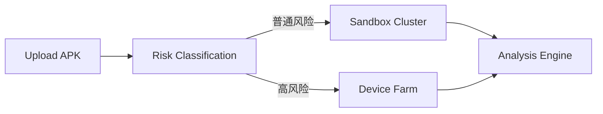

# 第6章 沙箱集群（Sandbox Cluster）

> **Chapter 6**
>
> **Sandbox Cluster**

---

# 1. 本章目标（Objectives）

沙箱集群（Sandbox Cluster）是移动应用安全检测平台进行大规模动态分析的核心执行环境。

相比真机平台，沙箱具有部署成本低、资源利用率高、环境恢复快、自动化程度高等优势，可承担绝大多数应用的初筛及批量动态检测任务。

本章介绍沙箱集群的总体架构、环境管理、任务执行、运行时监控、环境恢复及关键技术指标，并说明其与真机平台的协同关系。

---

# 2. 为什么需要沙箱集群（Motivation）

在应用商店审核场景中，平台每天需要处理大量应用及版本更新。

若全部依赖真机执行，将面临以下问题：

- 设备采购及维护成本高；
- 真机数量有限，并发能力不足；
- 环境初始化耗时长；
- 难以快速恢复到初始状态；
- 无法满足持续集成及批量检测需求。

因此，需要构建统一的沙箱集群，作为动态检测的默认执行环境。

平台采用**“沙箱优先、真机验证”**的策略：

- 沙箱负责大规模自动化检测；
- 真机负责高风险样本验证、反环境识别及硬件相关检测。

两者共同构成完整的动态检测体系。

---

# 3. 总体架构



沙箱集群由六个核心组件组成：

| 组件 | 职责 |
|------|------|
| Sandbox Manager | 沙箱生命周期管理 |
| Sandbox Pool | 沙箱实例池管理 |
| Runtime Executor | 应用安装、启动及自动执行 |
| Behavior Monitor | 运行时行为监控 |
| Evidence Collector | 检测证据采集 |
| Snapshot Manager | 快照创建与环境恢复 |

---

# 4. 沙箱生命周期管理

每个检测任务均运行于独立沙箱实例。

生命周期包括：

```text
Create
    │
Initialize
    │
Install App
    │
Execute
    │
Collect Evidence
    │
Reset
    │
Recycle
```

各阶段职责如下：

| 阶段 | 描述 |
|------|------|
| Create | 创建新的沙箱实例 |
| Initialize | 初始化系统环境及模拟数据 |
| Install App | 安装待检测应用 |
| Execute | 执行自动化检测流程 |
| Collect Evidence | 导出日志、网络、截图等数据 |
| Reset | 恢复到初始快照 |
| Recycle | 回收资源，返回实例池 |

---

# 5. 核心组件设计

## 5.1 Sandbox Manager

负责统一管理沙箱实例。

主要职责包括：

- 创建实例；
- 销毁实例；
- 健康检查；
- 资源统计；
- 生命周期管理；
- 标签管理；
- 版本管理。

---

## 5.2 Sandbox Pool

采用实例池设计。

预创建一定数量的空闲实例，避免每次检测重新启动虚拟环境。

典型状态包括：

| 状态 | 描述 |
|------|------|
| Idle | 空闲，可分配 |
| Running | 正在执行任务 |
| Resetting | 环境恢复中 |
| Offline | 不可用 |
| Error | 故障待处理 |

---

## 5.3 Runtime Executor

负责检测任务执行。

包括：

- 安装应用；
- 启动应用；
- 权限自动授权；
- 自动输入；
- 页面跳转；
- Monkey 测试；
- UI 自动化；
- 自定义检测脚本。

---

## 5.4 Behavior Monitor

负责运行时行为采集。

监控内容包括：

### 系统调用

- Binder
- ContentProvider
- Activity
- Service
- Broadcast

### 文件访问

- SQLite
- SharedPreferences
- External Storage

### 网络行为

- HTTP
- HTTPS
- DNS
- Socket
- WebSocket

### 权限行为

- Camera
- Microphone
- Contacts
- SMS
- Location
- Clipboard

### Native 行为

- JNI
- dlopen
- mmap
- ptrace
- fork

---

## 5.5 Evidence Collector

统一输出检测证据：

- Runtime Log
- Hook Event
- Network PCAP
- Screenshot
- Screen Recording
- File Snapshot
- Memory Snapshot
- Crash Log

所有证据统一传递至 Analysis Engine。

---

## 5.6 Snapshot Manager

每个沙箱均维护基础快照。

支持：

- 快速恢复；
- 环境回滚；
- 快照版本管理；
- 增量恢复。

快照机制保证不同检测任务之间完全隔离。

---

# 6. 调度策略

平台采用资源感知调度（Resource-Aware Scheduling）。

调度维度包括：

- Android API Level；
- HarmonyOS Version；
- CPU ABI；
- Root 状态；
- GPU 能力；
- 网络环境；
- 空闲资源；
- 历史故障率。

调度目标：

1. 优先使用空闲实例；
2. 保持负载均衡；
3. 降低环境切换成本；
4. 保证任务公平性；
5. 提高整体吞吐能力。

---

# 7. 与真机平台的协同



平台根据应用风险等级自动选择执行环境：

| 风险等级 | 执行环境 |
|----------|----------|
| 普通应用 | 沙箱 |
| 高风险样本 | 真机 |
| 环境对抗样本 | 真机 |
| 硬件相关行为 | 真机 |
| 批量检测 | 沙箱 |

这种协同机制兼顾检测效率与检测准确率。

---

# 8. 关键技术

## 8.1 高仿真运行环境

降低应用识别沙箱环境的概率，保证运行行为与真实设备一致。

---

## 8.2 快速恢复

通过快照恢复技术，使每个任务均运行于干净环境。

---

## 8.3 高并发执行

支持大规模并发动态检测，提高平台整体吞吐能力。

---

## 8.4 自动化运行

支持无人值守执行：

- 自动安装；
- 自动操作；
- 自动恢复；
- 自动回收。

---

# 9. 技术指标（Metrics）

| 指标 | 建议值 |
|------|--------:|
| 单集群并发实例数 | ≥1000 |
| 沙箱启动时间 | ≤20 秒 |
| 环境恢复时间 | ≤60 秒 |
| 应用安装成功率 | ≥99% |
| 应用启动成功率 | ≥98% |
| Runtime 数据采集覆盖率 | ≥95% |
| 网络流量采集覆盖率 | 100% |
| 快照恢复成功率 | ≥99% |
| 平均任务调度时间 | ≤3 秒 |
| CPU 平均利用率 | ≥70% |
| 内存平均利用率 | ≥75% |

---

# 10. 本章总结（Summary）

沙箱集群是移动应用安全检测平台的大规模动态分析基础设施。

通过统一的实例管理、生命周期管理、行为监控及快照恢复机制，平台能够在保证环境隔离和检测一致性的前提下，实现高并发、自动化的动态检测能力。

沙箱平台与真机平台协同工作，共同构成平台的运行环境，为后续 Analysis Engine 提供可信、完整的运行数据。

---

## 下一章

**第7章 环境仿真（Environment Simulation）**

下一章将详细介绍环境仿真的总体设计，包括设备画像、用户画像、网络环境、地理位置、时间环境及反环境识别策略，并说明如何提高动态检测的真实性和覆盖率。
