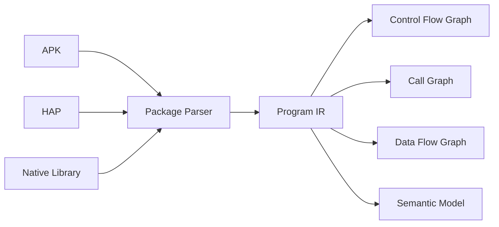

# 第11章 程序统一表示与程序分析基础（Program Representation & Analysis）

> **Chapter 11**
>
> **Program Representation & Analysis**

---

# 1. 本章目标（Objectives）

程序统一表示（Program Representation）是移动应用安全分析平台理解应用逻辑的核心基础。

由于移动应用存在：

- 多语言；
- 多编译体系；
- 多运行环境；

平台不能直接针对某一种字节码进行安全分析。

因此需要构建统一程序表示模型：

> 将不同平台、不同语言、不同执行体系转换为统一可分析的数据结构。

本章介绍：

- 程序表示模型；
- 中间表示（IR）；
- 控制流分析；
- 调用图分析；
- 数据流分析；
- 程序语义模型。

---

# 2. 为什么需要 Program Representation

移动应用代码来源复杂：

Android：

```
Java

Kotlin

C/C++

↓

DEX

↓

ART Runtime
```


HarmonyOS：

```
ArkTS

C/C++

↓

ABC

↓

Ark Runtime
```


如果直接分析：

- DEX；
- ABC；
- ELF；

会产生：

- 分析逻辑重复；
- 能力无法复用；
- 检测规则无法统一。


因此需要：

```
不同代码体系

↓

统一程序模型

↓

统一安全分析

```

---

# 3. 总体架构



---

# 4. Program IR（程序中间表示）

Program IR 是平台内部统一程序模型。

目标：

屏蔽：

- Android DEX差异；
- Harmony ABC差异；
- Native ELF差异。

---

# 5. IR核心模型

整体结构：

```
Program

├── Application

│

├── Component

│

├── Class

│

├── Method

│

├── Instruction

│

├── Call Relationship

│

├── Data Relationship

│

└── Resource Relationship

```

---

# 6. Application Model

描述应用整体属性。


包括：

## 基础信息

- Package Name
- Version
- Signature
- Developer


## 组件信息

包括：

- Activity
- Service
- Receiver
- Provider


## 权限模型

包括：

- Requested Permission
- Used Permission
- Permission Flow


---

# 7. Method Model

方法是程序分析核心对象。

描述：

```
Method

{

Name

Parameter

Return

Instruction

Caller

Callee

}

```

用于：

- 调用关系分析；
- 行为识别；
- 风险定位。

---

# 8. Instruction Model

不同平台指令统一抽象。


例如：

Android:

```
invoke-virtual

move-result

const-string
```


转换：

```
CALL

RETURN

STRING_CONST

```

---

Harmony:

```
ABC Instruction
```

转换为：

```
Unified Instruction

```

---

# 9. Control Flow Graph（CFG）

控制流图描述：

> 程序执行路径。


结构：

```
Method


Block A

  |

Block B

 / \

C   D

```

用途：

- 判断代码逻辑；
- 路径分析；
- 恶意逻辑发现。

---

应用场景：

## 权限调用路径

例如：

```
Location API

↓

Encrypt

↓

Upload

```

---

## 广告行为路径

例如：

```
Activity Start

↓

WebView Load

↓

Advertisement SDK

↓

Popup

```

---

# 10. Call Graph（调用图）

调用图描述：

> 方法之间如何调用。


示例：

```
App

 |

MainActivity

 |

SDK Function

 |

Network API

```

用途：

- SDK识别；
- 风险传播；
- 行为追踪。

---

调用关系包括：

## 静态调用

代码直接调用。


## 动态调用

例如：

- Reflection；
- Dynamic Load。


需要结合动态分析补充。

---

# 11. Data Flow Graph（数据流图）

数据流分析是隐私检测核心。

描述：

数据如何：

```
Source

↓

Process

↓

Sink

```

---

## Source

敏感数据来源：

包括：

- Location
- Contacts
- Camera
- Microphone
- Device ID


---

## Process

中间处理：

包括：

- Encrypt
- Encode
- Compress
- Store


---

## Sink

数据出口：

包括：

- Network
- File
- SDK API


---

示例：

```
Location

↓

App Function

↓

SDK

↓

HTTP Upload

```

形成：

Privacy Flow。

---

# 12. Semantic Model（程序语义模型）

传统程序分析关注：

代码结构。

安全分析更关注：

行为含义。


因此建立：

Semantic Model。

例如：

代码：

```
getLocation()

HttpRequest()

```

转换：

```
Collect Location

Send Remote Server

```

---

# 13. Security Fact Generation

程序分析最终输出：

Security Facts。


示例：

```json
{

"fact_type":

"privacy_flow",


"source":

"location",


"sink":

"network",


"path":

"A-B-C"

}

```

---

# 14. 关键分析技术

## 14.1 静态程序分析

包括：

- CFG Analysis；
- Call Graph；
- Data Flow；
- Taint Analysis。


---

## 14.2 跨语言分析

支持：

- Java；
- Kotlin；
- C/C++；
- ArkTS。


---

## 14.3 混淆代码分析

支持：

- Name Obfuscation；
- Control Flow Obfuscation；
- String Encryption。


---

## 14.4 动态补全

静态无法确定：

- Reflection；
- Dynamic Loading；
- Server Driven Logic。


通过 Runtime Data 补充。

---

# 15. 与检测服务关系

Program Representation 不直接判断：

“是否违规”。

它提供：

```
Program Facts

↓

Detection Service

↓

Risk Decision

```

---

# 16. 技术指标（Metrics）

| 指标 | 目标 |
|-|-:|
| IR转换成功率 | ≥98% |
| CFG构建成功率 | ≥95% |
| Call Graph覆盖率 | ≥90% |
| Data Flow分析覆盖率 | ≥90% |
| Native代码分析覆盖率 | ≥80% |
| 混淆代码处理能力 | ≥85% |
| 单应用建模时间 | ≤5分钟 |

---

# 17. 本章总结（Summary）

Program Representation 是移动应用安全分析平台理解应用逻辑的基础。

通过统一 IR、控制流图、调用图、数据流图和语义模型，平台能够将复杂移动应用转换为可计算的程序知识，为后续静态检测、动态检测和安全行为建模提供统一基础。

---

## 下一章

**第12章 静态分析引擎（Static Analysis Engine）**

下一章将进入具体检测能力：

- 代码扫描；
- API行为分析；
- 权限分析；
- Taint Analysis；
- SDK分析；
- 恶意代码特征分析；
- 静态安全事实生成。
