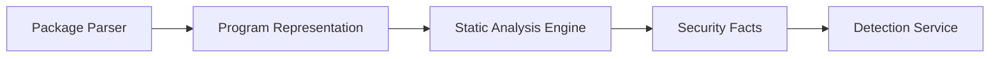
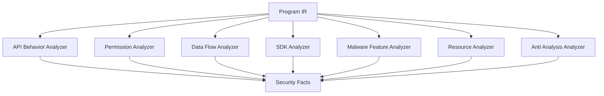

# 第12章 静态分析引擎（Static Analysis Engine）

> **Chapter 12**
>
> **Static Analysis Engine**

---

# 1. 本章目标（Objectives）

静态分析引擎（Static Analysis Engine）是在不运行应用的情况下，通过分析应用程序结构、代码逻辑、资源配置以及依赖组件，识别潜在安全风险的核心分析能力。

其核心目标：

> 从应用内部结构中发现可能导致安全、隐私、恶意行为的程序特征。

静态分析输出：

不是最终风险结论。

而是：

```
Application Structure

+

Program Behavior Pattern

+

Security Facts

```

供检测服务进一步判断。

---

# 2. 静态分析在整体架构中的位置



---

# 3. 静态分析总体架构



---

# 4. API行为分析（API Behavior Analysis）

移动应用大量安全行为通过系统 API 实现。

因此平台维护：

## Mobile Security API Knowledge Base

包括：

- Android API；
- HarmonyOS API；
- Native API；
- Third-party SDK API。

---

## API分类

### 敏感数据访问 API

例如：

```
Location

Camera

Microphone

Contacts

SMS

Device Identifier

```

---

### 系统能力 API

例如：

```
Accessibility

Notification

Overlay

Package Manager

```

---

### 网络通信 API

例如：

```
HTTP

Socket

WebView

DNS

```

---

### 动态执行 API

例如：

```
Reflection

ClassLoader

dlopen

LoadLibrary

```

---

# 5. 权限分析（Permission Analysis）

权限分析不仅关注：

“申请了什么权限”。

而关注：

```
Permission Request

        +

Permission Usage

        +

Permission Flow

```

---

## 分析内容

### 权限声明

来源：

Manifest。


例如：

```
READ_CONTACTS

CAMERA

LOCATION

```

---

### 权限使用

分析：

哪些代码路径真正调用。


例如：

```
Permission:

LOCATION


Code:

LocationManager.getLocation()

```

---

### 权限风险关联

例如：

```
读取通讯录

+

上传服务器

=

高风险隐私行为

```

---

# 6. 数据流分析（Data Flow Analysis）

数据流分析是隐私检测的核心技术。


目标：

发现：

```
Sensitive Source

        ↓

Processing

        ↓

Sensitive Sink

```

---

# 6.1 Source识别

敏感数据来源：

| 类型 | 示例 |
|-|-|
| 位置信息 | GPS |
| 身份信息 | Device ID |
| 联系信息 | Contacts |
| 生物信息 | Face/Fingerprint |
| 文件数据 | Photos |
| 通信数据 | SMS |

---

# 6.2 Sink识别

数据出口：

包括：

- HTTP请求；
- Socket；
- 文件写入；
- 第三方SDK。


---

# 6.3 Taint Analysis

采用污点传播模型：

```
Source

↓

Taint Propagation

↓

Sink

```

---

示例：

代码：

```
getLocation()

↓

encrypt()

↓

upload()

```

分析结果：

```
LOCATION_DATA_UPLOAD

```

---

# 7. SDK分析（SDK Analysis）

第三方 SDK 是移动应用生态的重要风险来源。


分析：

## SDK识别

技术：

- Signature Matching；
- Code Similarity；
- Graph Embedding。


---

## SDK行为分析

建立：

```
SDK

↓

API

↓

Behavior

```

关系。


例如：

某 SDK：

```
Camera

+

Location

+

Network

```

形成风险画像。

---

# 8. 恶意代码特征分析（Malware Feature Analysis）

静态提取：

## Code Feature

包括：

- API序列；
- 调用关系；
- 字符串；
- Opcode。


---

## Malware Pattern

例如：

### 信息窃取

```
Device Info

+

Network Upload

```


---

### 动态加载

```
Download File

+

Load Class

```

---

### 控制通信

```
C2 Domain

+

Socket

```

---

# 9. 资源分析（Resource Analysis）

应用资源也是重要安全信息来源。

分析：

## 字符串

发现：

- 域名；
- IP；
- 诈骗关键词；
- 隐藏配置。


---

## 图片资源

用于：

- 仿冒检测；
- Logo相似分析。


---

## Web资源

分析：

- HTML；
- JS；
- WebView内容。

---

# 10. 反分析检测（Anti Analysis Detection）

恶意应用可能主动规避检测。

检测：

## 环境检测代码

例如：

```
isEmulator()

checkRoot()

checkDebugger()

```

---

## 加密保护

包括：

- 字符串加密；
- 代码加密；
- 动态加载。


---

## 控制流混淆

包括：

- Opaque Predicate；
- Junk Code。


---

# 11. 静态分析结果模型

输出：

Security Facts。


示例：

```json
{
"type":

"privacy_flow",

"source":

"contacts",

"sink":

"network",

"confidence":

0.92
}

```

---

# 12. 静态规则体系

规则包括：

## API Rule

```
Sensitive API

↓

Risk Category

```

---

## Behavior Rule

```
Pattern

+

Condition

↓

Risk

```

---

## Graph Rule

```
Call Graph Pattern

↓

Malicious Behavior

```

---

# 13. AI增强分析

静态分析结合AI：

## Code Embedding

用于：

- 相似代码发现；
- 家族聚类。


---

## Semantic Understanding

理解：

代码意图。


例如：

```
Location

+

Upload

```

判断：

是否合理。

---

# 14. 关键技术指标（Metrics）

| 指标 | 目标 |
|-|-:|
| APK/HAP静态分析成功率 | ≥99% |
| API识别覆盖率 | ≥95% |
| Permission关联准确率 | ≥95% |
| 数据流分析覆盖率 | ≥90% |
| SDK识别准确率 | ≥95% |
| 恶意特征识别准确率 | ≥90% |
| 单应用分析时间 | ≤10分钟 |
| 误报率 | ≤10% |

---

# 15. 本章总结（Summary）

静态分析引擎通过程序结构分析、API行为分析、权限分析、数据流分析、SDK识别和恶意特征提取，将应用代码转换为结构化安全事实。

它不是简单的代码扫描工具，而是移动应用安全检测平台理解应用能力和潜在行为的重要基础。

静态分析结果将与动态分析结果融合，共同形成最终安全判断。

---

## 下一章

**第13章 动态分析引擎（Dynamic Analysis Engine）**

下一章进入运行时分析：

- 应用行为捕获；
- Hook体系；
- 系统调用监控；
- 网络行为分析；
- UI行为理解；
- 动态行为图；
- 静态动态融合分析。
