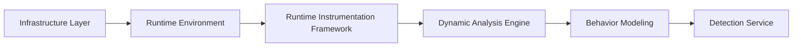
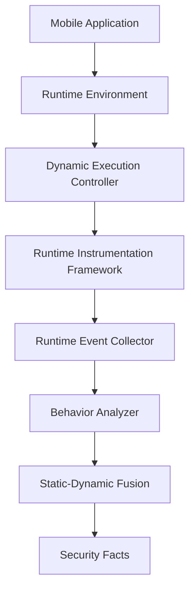
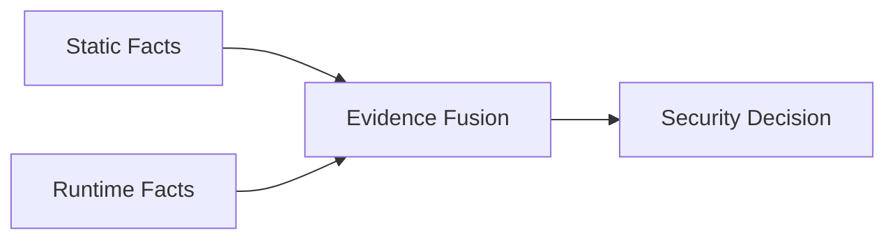

# 第13章 动态分析引擎（Dynamic Analysis Engine）

> **Chapter 13**
>
> **Dynamic Analysis Engine**

---

# 1. 本章目标（Objectives）

动态分析引擎（Dynamic Analysis Engine）是移动应用安全检测平台中负责**运行时行为理解与分析**的核心能力。

它通过在真实终端或高度仿真的运行环境中执行应用，采集应用运行过程中的行为证据，并结合静态分析结果，对应用实际安全风险进行判断。

动态分析解决的问题：

> 应用在真实运行过程中到底做了什么？

区别于静态分析：

| 分析方式 | 解决问题 |
|-|-|
| 静态分析 | 应用具备什么能力 |
| 动态分析 | 应用实际执行什么行为 |

---

# 2. 动态分析定位

动态分析属于：

```
Analysis Engine Layer

        |

Dynamic Analysis Engine

        |

Runtime Behavior Understanding

```

整体关系：



---

# 3. 动态分析核心职责

Dynamic Analysis Engine 不负责：

- 单独执行 Hook；
- 单独采集 API；
- 单独判断风险。

它负责：

## 3.1 动态任务控制

管理：

- 应用安装；
- 环境初始化；
- 执行策略；
- 自动交互；
- 数据采集。


---

## 3.2 运行证据管理

汇聚：

- API调用；
- 系统行为；
- 网络行为；
- UI行为；
- 文件行为；
- 内存行为。


---

## 3.3 行为分析

将：

```
Runtime Event

↓

Behavior Pattern

↓

Security Fact

```

---

## 3.4 静态动态融合

结合：

- Static Facts；
- Runtime Facts；

形成完整应用行为画像。

---

# 4. 动态分析总体架构



---

# 5. Dynamic Execution Controller

动态执行控制器负责：

> 管理一次完整应用运行生命周期。


---

## 5.1 生命周期管理


流程：

```
Prepare Environment

        ↓

Install Application

        ↓

Launch Application

        ↓

Execute Scenario

        ↓

Collect Evidence

        ↓

Terminate

        ↓

Reset Environment

```

---

# 6. 自动化行为驱动（Automated Interaction）

应用必须被触发才能产生行为。

因此需要自动化操作能力。


包括：

## UI探索

例如：

- 页面遍历；
- 点击；
- 输入；
- 滑动。


---

## 场景模拟

例如：

### 登录场景

```
打开APP

↓

输入账号

↓

提交

```

---

### 广告场景

```
启动APP

↓

等待

↓

检测弹窗

```

---

### 涉诈场景

```
进入页面

↓

触发流程

↓

识别诱导行为

```

---

# 7. Runtime Instrumentation Framework

Runtime Instrumentation 是动态分析的数据采集基础。

它负责：

> 获取应用运行过程中的原始行为事件。


包括：

## 7.1 API Hook

采集：

- Framework API；
- SDK调用；
- Native调用。


---

## 7.2 System Trace

采集：

- 文件访问；
- 进程行为；
- 系统调用。


---

## 7.3 Network Monitor

采集：

- DNS；
- IP；
- HTTP；
- HTTPS。


---

## 7.4 UI Behavior Capture

采集：

- 页面结构；
- 截图；
- OCR；
- 用户操作路径。


---

## 7.5 Memory Observation

采集：

- 动态加载；
- 内存代码；
- 解密行为。


---

# 8. Runtime Event Model

所有采集数据统一转换为：

Runtime Event。


示例：

```json
{
"type":

"network_request",

"app":

"com.example.app",

"destination":

"xxx.com",

"time":

"xxx"

}

```

---

事件类型：

| 类型 | 示例 |
|-|-|
| API Event | 调用Camera |
| Network Event | 上传数据 |
| File Event | 读取文件 |
| Process Event | 创建进程 |
| UI Event | 展示页面 |
| Memory Event | 加载代码 |

---

# 9. Behavior Analyzer

Behavior Analyzer 将低级事件转换为高级行为。


例如：

原始事件：

```
getDeviceId()

HTTPS POST

SDK Process

```

转换：

```
Device Identifier Collection

↓

Third-party SDK Upload

```

---

# 10. Behavior Graph

动态行为形成：

Behavior Graph。


示例：

```
Application Start

        |

Read Device Information

        |

Encrypt Data

        |

Upload Server

```

---

行为图节点：

- API；
- SDK；
- 页面；
- 网络目标；
- 数据对象。


边：

- 调用关系；
- 数据流；
- 时间关系。

---

# 11. Static-Dynamic Fusion

动态分析必须结合静态结果。


架构：



---

示例：

静态：

```
包含Location API

```

动态：

```
实际读取GPS

+

上传服务器

```

融合：

```
Privacy Risk

```

---

# 12. 动态分析应用场景

---

# 12.1 恶意软件检测

发现：

```
Download Payload

↓

Dynamic Load

↓

Execute

```

---

# 12.2 隐私违规检测

发现：

```
Sensitive Data

↓

Collect

↓

Upload

```

---

# 12.3 恶意广告检测

发现：

```
Background Activity

↓

Popup Window

↓

Auto Click

```

---

# 12.4 涉诈检测

结合：

- UI；
- OCR；
- 行为路径。


例如：

```
Fake Government Page

↓

Request Transfer

```

---

# 13. 动态分析抗对抗能力

移动恶意应用可能：

- 检测模拟器；
- 检测调试；
- 检测Hook；
- 延迟执行。


因此需要：

---

## 13.1 多环境执行

覆盖：

- 不同设备；
- 不同系统版本；
- 不同网络环境。


---

## 13.2 行为触发策略

包括：

- 深度UI探索；
- 时间控制；
- 用户行为模拟。


---

## 13.3 多源证据融合

避免：

单一Hook结果被绕过。

---

# 14. 性能与规模设计

动态分析通常成本较高。

需要：

## 分级检测策略

```
Low Risk

↓

Static Only


Medium Risk

↓

Sandbox Dynamic


High Risk

↓

Real Device Dynamic

```

---

## 并行执行

支持：

- 多沙箱节点；
- 多真机节点；
- 任务队列调度。


---

# 15. 技术指标（Metrics）

| 指标 | 目标 |
|-|-:|
| 应用启动成功率 | ≥98% |
| 动态执行成功率 | ≥95% |
| Runtime行为采集覆盖率 | ≥95% |
| 网络行为采集率 | 100% |
| UI行为采集覆盖率 | ≥90% |
| 第三方SDK行为识别率 | ≥95% |
| 高风险行为发现准确率 | ≥90% |
| 单应用动态分析时间 | ≤15分钟 |

---

# 16. 本章总结（Summary）

Dynamic Analysis Engine 是移动应用安全检测平台理解应用真实行为的核心分析能力。

它通过：

```
Runtime Environment

↓

Instrumentation

↓

Runtime Event

↓

Behavior Modeling

↓

Security Fact

```

形成完整运行时分析链路。

其中：

- Runtime Instrumentation 负责“观察”；
- Dynamic Analysis Engine 负责“组织和理解”；
- Detection Service 负责“风险判断”。

三者共同构成移动应用安全检测平台的动态分析体系。

---

## 下一章

**第14章 动态运行时采集框架（Runtime Instrumentation Framework）**

下一章详细展开：

- Hook Framework；
- System Trace；
- Network Monitor；
- UI Capture；
- Memory Observation；
- Event Pipeline；
- 性能优化；
- 对抗检测。
