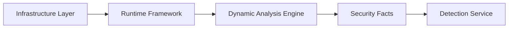
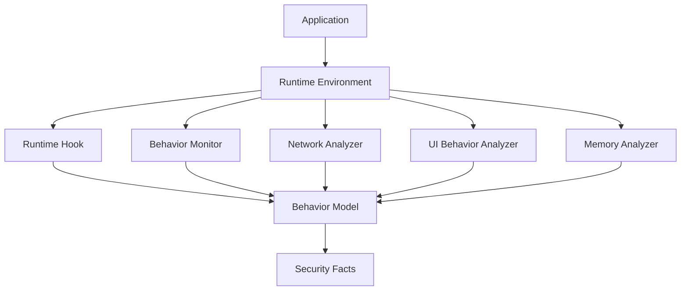
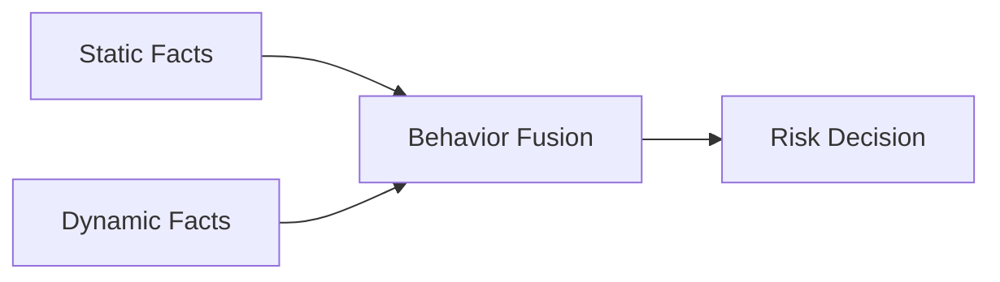

# 第13章 动态分析引擎（Dynamic Analysis Engine）

> **Chapter 13**
>
> **Dynamic Analysis Engine**

---

# 1. 本章目标（Objectives）

动态分析引擎（Dynamic Analysis Engine）是在真实或高度仿真的移动终端环境中，通过运行应用并采集运行过程中的行为数据，识别应用真实安全风险的核心分析能力。

其核心目标：

> 从应用运行过程中获取真实行为证据，发现静态分析无法覆盖的安全问题。

动态分析关注：

- 应用运行行为；
- 数据访问行为；
- 网络通信行为；
- 系统调用行为；
- 第三方 SDK 行为；
- 用户交互行为。

---

# 2. 动态分析定位

动态分析位于 Analysis Engine Layer：



输入：

来自：

- Sandbox Cluster；
- Device Farm；
- Runtime Framework。

输出：

统一：

Security Facts。

---

# 3. 为什么需要动态分析

静态分析存在天然限制：

## 代码不存在

例如：

服务器动态下发：

```
Download

↓

Load Module

↓

Execute

```

静态无法看到。

---

## 行为由环境决定

例如：

```
Location = China

↓

展示诈骗页面

```

---

## 第三方 SDK 动态行为

例如：

广告 SDK：

```
启动App

↓

请求配置

↓

弹窗广告
```

---

## 加固与混淆

例如：

代码：

```
Encrypted Payload
```

运行后：

```
Malicious Logic
```

---

因此必须通过运行时观察。

---

# 4. 动态分析总体架构



---

# 5. 动态执行流程

标准流程：

```text
1. Environment Prepare

        ↓

2. Install Application

        ↓

3. Launch Application

        ↓

4. Automated Interaction

        ↓

5. Runtime Collection

        ↓

6. Behavior Analysis

        ↓

7. Generate Security Facts

```

---

# 6. Runtime Behavior Collection

动态分析核心是：

> 全面捕获应用运行事实。

---

# 6.1 API调用监控

监控：

## 系统API

包括：

- Location；
- Camera；
- Microphone；
- Contacts；
- SMS；
- Storage；
- Accessibility。


---

## 网络API

包括：

- HTTP；
- HTTPS；
- Socket；
- DNS。


---

## 系统能力

包括：

- Process；
- Package；
- File；
- Crypto。


---

# 7. Hook Framework

Hook 是动态分析核心技术。

目标：

在不修改应用代码情况下：

捕获关键行为。

---

# 7.1 Hook层级

## Java Framework Hook

监控：

- Android Framework API；
- SDK调用。


---

## Native Hook

监控：

- libc；
- syscall；
- JNI。


---

## Kernel / System Layer

监控：

- 文件访问；
- 网络连接；
- 进程行为。


---

# 7.2 Hook事件模型

统一事件：

```json
{
"type":

"api_call",

"process":

"app",

"api":

"LocationManager",

"time":

"xxx"

}
```

---

# 8. Network Behavior Analysis

网络行为是风险判断的重要依据。


分析：

## 通信对象

包括：

- Domain；
- IP；
- ASN；
- Certificate。


---

## 通信内容

包括：

- Header；
- Payload；
- Parameter。


---

## 风险识别

例如：

```
Collect Device Info

+

Send Unknown Server

```

形成：

高风险行为。

---

# 9. UI Behavior Analysis

部分风险无法通过API发现。

例如：

诈骗。

需要理解：

用户看到什么。

分析：

- 页面截图；
- OCR；
- 页面结构；
- 点击路径。


---

示例：

```
打开App

↓

展示公安机关页面

↓

要求转账

```

识别：

涉诈行为。

---

# 10. Memory Analysis

针对：

动态加载。

分析：

## 内存区域

包括：

- Heap；
- Stack；
- Code Segment。


---

## 动态模块

发现：

```
Download

↓

Memory Load

↓

Execute
```

---

# 11. Behavior Graph

动态行为转换为：

Behavior Graph。


例如：

```
App Start

    |

Read Device ID

    |

Encrypt

    |

Upload Server

```


形成：

```
Behavior Chain

```

---

# 12. Static + Dynamic Fusion

动态分析不是独立运行。


融合：



---

示例：

静态：

```
has Location API

```

动态：

```
actual Location Upload

```

融合：

```
Privacy Violation

```

---

# 13. 关键检测能力

## 恶意软件

识别：

- 木马；
- 信息窃取；
- C2通信；
- 动态加载。


---

## 隐私违规

识别：

- 非必要采集；
- 未授权访问；
- 数据上传。


---

## 恶意广告

识别：

- 弹窗；
- 后台广告；
- 自动点击。


---

## 涉诈

识别：

- 引导流程；
- 仿冒页面；
- 诈骗话术。


---

# 14. 动态分析抗对抗能力

应用可能检测：

- 模拟器；
- Hook；
- 调试环境。


因此平台需要：

## 环境多样性

多个：

- 设备；
- 系统；
- 用户环境。


---

## 行为交叉验证

同一应用：

多环境执行。

---

## 真机补充验证

高风险应用进入 Device Farm。

---

# 15. 技术指标（Metrics）

| 指标 | 目标 |
|-|-:|
| 应用启动成功率 | ≥98% |
| Runtime行为采集覆盖率 | ≥95% |
| API Hook覆盖率 | ≥95% |
| 网络行为采集率 | 100% |
| 第三方SDK行为识别率 | ≥95% |
| 动态分析任务成功率 | ≥98% |
| 单应用动态执行时间 | ≤15分钟 |
| 高风险行为发现准确率 | ≥90% |

---

# 16. 本章总结（Summary）

动态分析引擎通过真实运行应用、采集运行时行为、构建行为模型，实现对移动应用真实安全风险的发现。

它弥补静态分析无法覆盖动态逻辑、服务端控制和运行环境相关行为的问题。

静态分析回答：

> “应用可能做什么。”

动态分析回答：

> “应用实际上做什么。”

二者共同构成移动应用安全分析平台的核心分析能力。

---

## 下一章

**第14章 Runtime Hook Framework（运行时Hook框架）**

下一章将深入动态分析最核心技术：

- Hook架构；
- Java Hook；
- Native Hook；
- Kernel级采集；
- Event Pipeline；
- Hook稳定性；
- 性能优化；
- 对抗检测。
