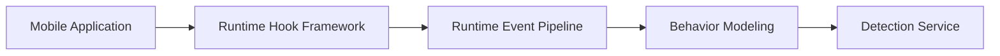
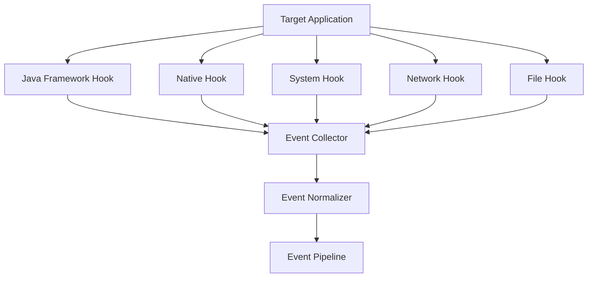

# 第14章 运行时 Hook 框架（Runtime Hook Framework）

> **Chapter 14**
>
> **Runtime Hook Framework**

---

# 1. 本章目标（Objectives）

运行时 Hook 框架（Runtime Hook Framework）是移动应用动态分析体系中的核心数据采集组件。

其目标：

> 在不修改应用程序逻辑的情况下，对应用运行过程中的关键行为进行透明采集。

包括：

- 系统 API 调用；
- Native 调用；
- 文件访问；
- 网络通信；
- 权限使用；
- 动态加载；
- 进程行为。

Hook Framework 输出标准化运行事件，为：

- Dynamic Analysis Engine；
- Behavior Modeling；
- Detection Service；

提供基础数据。

---

# 2. Hook Framework 在系统中的位置



---

# 3. 为什么需要 Hook Framework

移动应用大量安全行为隐藏在运行阶段：

例如：

代码：

```
loadConfig()
```

运行：

```
download payload

↓

decrypt

↓

execute

```

静态无法准确判断。

必须：

观察：

```
真实调用

+

真实参数

+

真实数据流

```

---

# 4. Hook Framework 总体架构



---

# 5. Hook 分层设计

移动应用运行环境包含多个层级。

因此采用多层 Hook 架构。

---

# 5.1 Framework API Hook

主要针对：

Android Framework。

监控：

## 隐私相关 API

例如：

```
LocationManager

CameraManager

AudioRecord

ContactsProvider

```

---

## 系统能力 API

例如：

```
PackageManager

AccessibilityService

NotificationManager

```

---

## 网络 API

例如：

```
HttpURLConnection

OkHttp

WebView

Socket

```

---

# 5.2 Native Hook

移动应用大量使用 Native 代码。

Native Hook 负责：

捕获：

- libc调用；
- JNI调用；
- 动态加载。


重点函数：

```
open()

read()

write()

connect()

send()

recv()

dlopen()

ptrace()

```

---

# 5.3 System / Kernel Hook

针对更深层行为。

包括：

- 文件系统；
- 网络连接；
- 进程创建；
- 内存访问。


能力：

发现：

- 隐藏通信；
- 后台执行；
- 恶意加载。

---

# 6. Hook Event Model

所有 Hook 数据统一转换为事件模型。


标准结构：

```json
{
"event_type":

"api_call",

"process":

"com.xxx.app",

"api":

"getLocation",

"timestamp":

"xxx",

"parameters":

{}
}

```

---

# 7. Event Pipeline

Hook 产生大量事件。

需要事件处理流水线：

```
Capture

↓

Filter

↓

Normalize

↓

Enrich

↓

Store

```

---

# 7.1 Capture

采集原始事件。

---

# 7.2 Filter

过滤：

- 无风险系统调用；
- 重复事件。

降低数据量。

---

# 7.3 Normalize

统一：

Android

HarmonyOS

Native

事件格式。

---

# 7.4 Enrich

增加：

- 应用信息；
- SDK信息；
- 风险标签。


---

# 8. Hook 数据关联

单个 API 无法判断风险。

需要关联：

## 调用链

例如：

```
Activity

↓

SDK

↓

Location API

↓

Network

```

---

## 数据流

例如：

```
Contact

↓

Encrypt

↓

Upload

```

---

## 时间序列

例如：

```
Install

↓

First Launch

↓

Permission

↓

Data Upload

```

---

# 9. Hook 在安全检测中的应用

---

## 9.1 隐私检测

发现：

```
Read Location

+

Upload Server

```

生成：

Privacy Fact。

---

## 9.2 恶意广告检测

发现：

```
Background Start Activity

+

Overlay Window

+

Click Simulation

```

判断：

恶意广告行为。

---

## 9.3 木马检测

发现：

```
Download File

↓

Load Library

↓

Execute

```

判断：

动态恶意代码。

---

## 9.4 涉诈检测

发现：

```
Fake Login Page

+

Input Sensitive Information

```

结合 UI 分析。

---

# 10. Hook 稳定性设计

Hook 框架必须保证：

## 不影响应用运行

要求：

- 低侵入；
- 异步采集；
- 异常隔离。


---

## 支持多版本系统

覆盖：

Android：

- Android 8
- Android 9
- Android 10
- Android 11
- Android 12+
- Android 15


HarmonyOS：

- HarmonyOS 4+
- HarmonyOS 5+

---

# 11. 对抗能力

部分应用会检测：

- Hook存在；
- 调试环境；
- 注入模块。

因此需要：

## 多采集模式

包括：

- Framework Hook；
- Native Hook；
- System Observation。


---

## 数据一致性验证

通过：

多来源数据交叉验证。

例如：

Hook：

```
Location API

```

系统：

```
GPS Event

```

一致确认。

---

# 12. 性能设计

Hook 不应影响应用正常运行。

优化：

## 异步事件上传

```
Hook Thread

↓

Buffer

↓

Collector

```

---

## 事件采样

高频事件：

例如：

```
read()

write()

```

采用：

- 聚合；
- 降采样。


---

# 13. 技术指标（Metrics）

| 指标 | 目标 |
|-|-:|
| API Hook覆盖率 | ≥95% |
| Native行为覆盖率 | ≥90% |
| 网络行为采集率 | 100% |
| 文件行为采集率 | ≥95% |
| 事件丢失率 | ≤1% |
| 单事件采集延迟 | ≤10ms |
| CPU额外开销 | ≤10% |
| 内存额外占用 | ≤200MB |

---

# 14. 本章总结（Summary）

Runtime Hook Framework 是动态分析体系的底层观测能力。

通过多层 Hook 技术、统一事件模型和高性能事件流水线，平台能够持续获取应用运行过程中的真实行为，为恶意软件检测、隐私分析、广告检测和涉诈识别提供可信数据基础。

Hook Framework 的能力深度直接决定动态分析能力上限。

---

## 下一章

**第15章 行为建模引擎（Behavior Modeling Engine）**

下一章将介绍：

- Runtime Event 如何转换为安全行为；
- 行为图（Behavior Graph）；
- 应用行为画像；
- 行为聚类；
- 恶意行为模式识别；
- AI行为理解基础。
